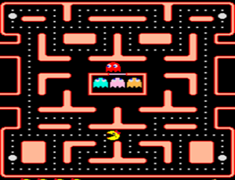
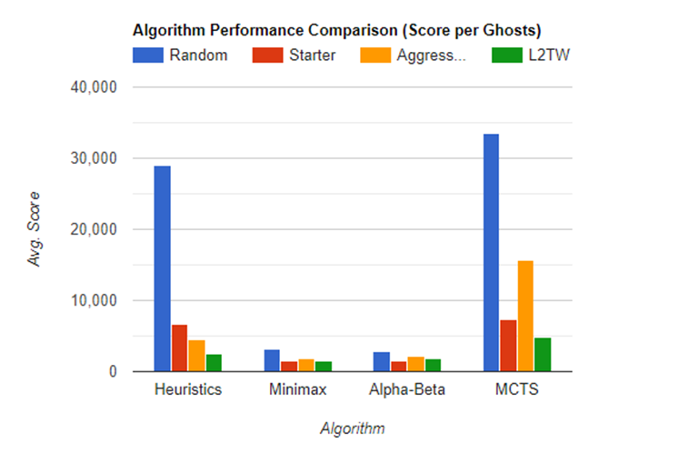

# Pac-Man Game:
## Monte Carlo Tree Search (MCTS) vs. Minimax vs. Alpha-Beta Pruning vs. Heuristics Research Project

### Introduction:
Welcome to our Pac-Man game project! Our main goal is to help Pac-Man earn as many points as possible by eating pills and scared ghosts while avoiding hostile spirits. With 11 different dungeons and 3 souls for Pac-Man, the game requires a balance between long-term planning and short-term decision-making to optimize Pac-Man's benefit and minimize damage from the ghosts.

To achieve this balance, we will be exploring different algorithms such as the Monte Carlo Tree Search (MCTS), Minimax, Alpha-Beta Pruning, and heuristics. The MCTS algorithm has a strong reputation for producing good results in games that require real-time decision making, while Minimax and Alpha-Beta Pruning offer an alternative approach that examines all possibilities but with less calculation time. Lastly, heuristics will provide a faster option that focuses on short-term planning.

### Methods:
#### 1. Monte Carlo Tree Search (MCTS)
MCTS is a promising algorithm for Pac-Man because it manages to balance long-term and short-term planning through its simulation phase. By simulating different outcomes, we can estimate the quality of different situations in the long term.

#### 2. Minimax
In addition to MCTS, we also plan to investigate Minimax, an algorithm that examines all possible moves using a tree structure. However, since Pac-Man has a time limit on making a move, the height of its tree should be significantly smaller than that of MCTS. We expect that a smaller tree height will cause Minimax to emphasize near-range planning more than far-range planning, although more accurately than MCTS.

#### 3. Alpha-Beta Pruning
To address the issue of calculation time, we will also compare the Alpha-Beta Pruning algorithm to Minimax. Alpha-Beta Pruning provides the same results as Minimax but with less calculation time.

#### 4. Heuristics
Finally, we will also test a heuristic approach, where we score each possible move and select the move with the highest score at each decision point. This approach is fast and emphasizes short-term planning without considering the long-term.

### Results:

### Conclusion:

We found that heuristics worked well initially, but as the ghosts became smarter, Pacman's performance deteriorated. Minimax and Alpha-Beta Pruning made Pacman too cautious, resulting in a low score. Ultimately, we found that MCTS was the best algorithm, combining score pursuit with caution and safety measures. Our exploration of different methods and algorithms provided insights into optimizing real-time environments and can contribute to future research in this area.

### Contributing
Feel free to fork this repository and make your own contributions! We welcome pull requests and suggestions for improving the code or trying out different algorithms.

### Installation:
1. Clone the repository
2. Install the requirements
3. Run the game
